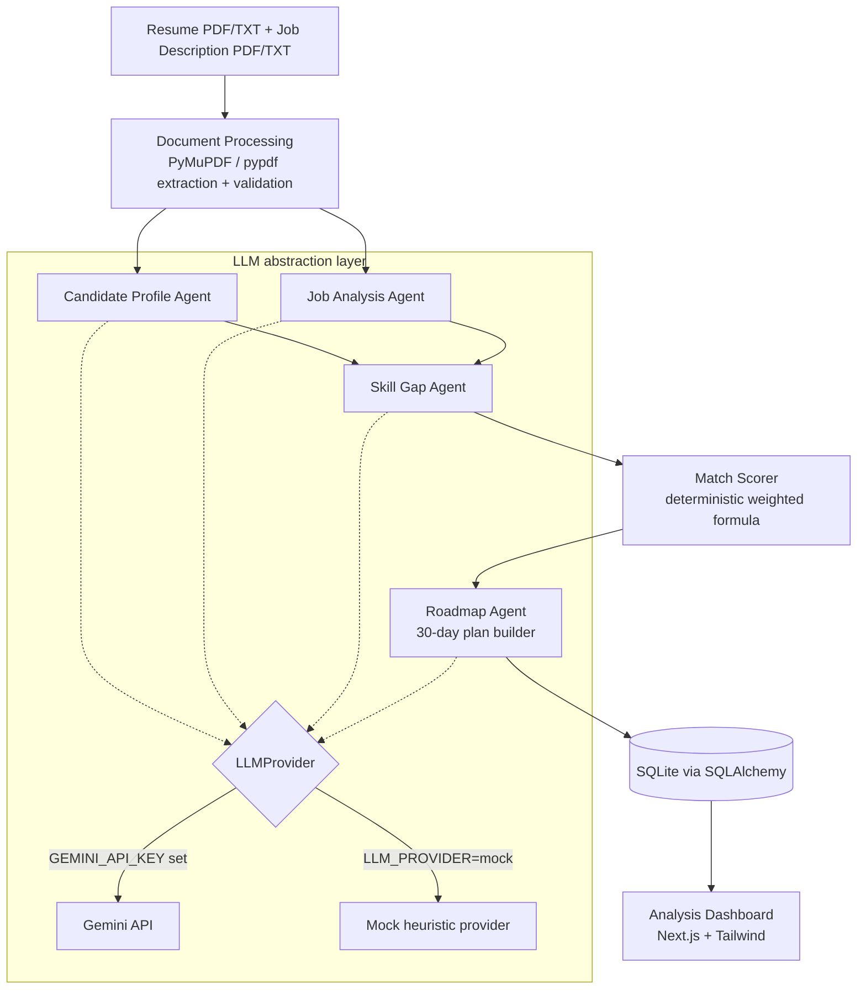
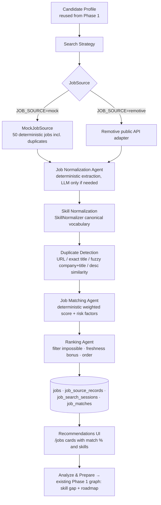
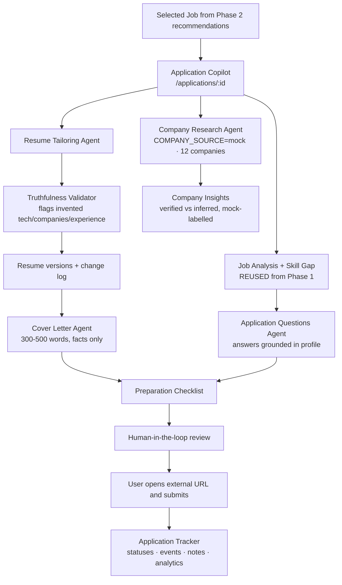

# Job Switch Agent

**Your AI career team for a smarter job switch.**

Job Switch Agent analyzes your resume against a target job description, identifies
skill gaps, computes a transparent match score, and generates a personalized
30-day preparation roadmap — all powered by a multi-agent LangGraph pipeline.

**Phase 2 adds live job discovery**, **Phase 3 the Application Copilot**, and
**Phase 4 makes discovery genuinely real-time**: a provider-based aggregation
layer pulls current jobs from legitimate public APIs (Remotive, Arbeitnow,
Jobicy, Adzuna, Greenhouse company boards), normalizes and deduplicates them,
caches them in SQLite, and feeds the existing matching/ranking — with per-source
status in the UI, mock data always labelled "Demo Data", TTL caching and
rate-respecting URL validation. See [docs/job-sources.md](docs/job-sources.md).

---

## 1. Project Overview

Upload two documents:

- **Resume** (PDF or TXT)
- **Target job description** (PDF or TXT)

The backend pipeline then:

1. Extracts text from both documents.
2. Runs a **Candidate Profile Agent** to structure the resume.
3. Runs a **Job Analysis Agent** to structure the job requirements.
4. Runs a **Skill Gap Agent** to classify every requirement as `matched`,
   `partial`, or `missing` against verified candidate skills.
5. Computes a **transparent, deterministic match score** (never LLM-guessed).
6. Runs a **Roadmap Agent** to build a realistic 30-day study plan that
   prioritizes high-impact gaps.
7. Persists everything and serves it to the dashboard UI.

A **mock LLM provider** makes the entire flow work offline with zero API cost,
using deterministic heuristics instead of an LLM.

## 2. Architecture Diagram



## 2b. Phase 2 Architecture — Job Discovery & Matching



**Design rationale (Phase 2):**

- *Discovery is separated from matching* so sources can change freely; matching
  always operates on the same normalized `Job` schema.
- *Scoring is deterministic code* — the LLM never assigns scores; weights are
  configurable and missing data (salary/location) redistributes weight instead
  of punishing the job.
- *LLM calls are limited* to semantic tasks that genuinely need them (optional
  normalization assist, optional query refinement, explanations). Sorting,
  filtering, dedup, scoring and DB work are pure Python — cheap and testable.
- *Job sources use a `JobSource` protocol* (`services/job_sources/base.py`) so a
  new board is one adapter away; nothing else in the pipeline knows about it.
- *Mock mode exists* so discovery → dedupe → matching → ranking runs fully
  offline with zero cost and deterministic results for tests.
- *Phase 2 connects to Phase 1* through "Analyze & Prepare": it reuses the stored
  candidate profile and pipes a discovered job's normalized text into the exact
  same Phase 1 LangGraph analysis (skill gap + match score + roadmap).

## 2c. Phase 3 Architecture — Application Copilot & Tracking



**Phase 3 design rules:**

- *Human-in-the-loop*: generated resumes/letters must be approved by the user;
  the app opens the external application URL but never fills or submits forms.
- *Truthfulness Validator* (pure code): any technology, employer, education or
  experience claim in a tailored resume that is not evidenced by the original is
  flagged with an explicit warning — related tools (Docker vs Kubernetes) do NOT
  count as evidence.
- *Versioning*: tailored resumes are stored per application (`resume_versions` +
  `resume_changes`); the master resume text is never modified. Exports: TXT,
  Markdown, PDF (dependency-free writer).
- *Cost control*: cover letters, questions and tailoring run on the shared LLM
  abstraction with deterministic mock implementations; results are cached per
  application until the user explicitly regenerates.
- *Mock company data* is always labelled "Demo / Mock company data" in the UI.

```text
Overall pipeline:
Phase 1  Resume + Job Analysis  →  Phase 2  Discovery + Matching  →  Phase 3  Preparation + Tracking
```


## 3. Why Multi-Agent Architecture?

- **Separation of concerns** — extraction, comparison, scoring, and planning are
  very different tasks; each agent has its own focused prompt, schema, and tests.
- **Hallucination control** — each agent's output is validated with Pydantic and
  cross-checked against structured data before it can influence the next step.
- **Extensibility** — future phases (job scraping, auto-apply, notifications)
  can add new agents/nodes without rewriting the existing graph.
- **Testability** — agents are small classes with one public method each;
  business logic lives in pure functions independent of any LLM.
- **Provider freedom** — because agents only see the `LLMProvider` interface,
  swapping Gemini for Ollama/local models requires no agent changes.

## 4. Agent Responsibilities

| Agent | Input | Output | Guardrails |
|---|---|---|---|
| Candidate Profile Agent (`app/agents/candidate_agent.py`) | Raw resume text | `CandidateProfile`: name, experience, roles, education, skills by category, projects, certifications | Never invents skills/experience; missing values become `null` |
| Job Analysis Agent (`app/agents/job_agent.py`) | Raw JD text | `JobProfile`: role, required vs preferred skills, tech stack, responsibilities, education | Required/preferred kept strictly separate |
| Skill Gap Agent (`app/agents/skill_gap_agent.py`) | Both profiles | `SkillGapAnalysis`: matched/partial/missing lists + per-gap importance, reason, action | Every item re-verified against real profiles; hallucinated skills dropped; unclassified requirements fall back to deterministic classification |
| Match Scorer (`app/services/match_scorer.py`) | Profiles + weights | `MatchScore`: overall score + 5-part breakdown | Pure code — the LLM is never asked for a score |
| Roadmap Agent (`app/agents/roadmap_agent.py`) | Gaps + score + config | `Roadmap`: 30 daily tasks grouped into weeks | Realism validation (day coverage, hours cap); deterministic fallback builder |

### Phase 2 agents & services

| Component | Location | Responsibility |
|---|---|---|
| Job Discovery Agent | `app/agents/discovery_agent.py` | Candidate profile + preferences → bounded query strategy (role aliases + skill variants); queries the configured `JobSource` |
| Job Normalization Agent | `app/services/job_normalizer.py` | `RawJob` → canonical `Job`: regex extraction of experience ("2+ yrs", "2 to 4 years"), salary (LPA), work mode, employment type; skills from the curated vocabulary split required vs preferred. LLM assist only in Gemini mode when fields are missing |
| SkillNormalizer | `app/services/skill_normalizer.py` | Canonical skill mapping (GenAI/Generative AI → same key; K8s → Kubernetes) with configurable overrides via `SKILL_CANONICAL_MAP_JSON` |
| Duplicate Detection | `app/services/duplicate_detector.py` | Union-find grouping by URL equality, exact normalized title at one company, synonym-expanded title subset/ratio, or long-description similarity ≥ threshold. Canonical record keeps richest fields + full provenance |
| Job Matching Service | `app/services/job_matcher.py` | Per-job deterministic score: required/preferred skill coverage (partial = half credit), role similarity, experience-band fit (quadratic shortfall penalty), location and salary with weight redistribution when not applicable; risk factors; fact-based explanation builder |
| Ranking Agent | `app/services/ranking.py` | Filters impossible jobs (experience < 40% fit), freshness bonus (+2 ≤7d, +1 ≤14d), orders by adjusted score → experience → salary |
| Job Discovery Pipeline | `app/agents/job_discovery_orchestrator.py` | LangGraph: strategy → discover → normalize → dedupe → match → rank, with accumulating `errors` channel like Phase 1 |

## 5. LangGraph Workflow

Defined in `app/agents/orchestrator.py` (Phase 1) and
`app/agents/job_discovery_orchestrator.py` (Phase 2):

```text
Phase 1 analysis graph:
START → process_documents → ┬─ candidate_agent ─┐ → skill_gap_agent
                            └─ job_agent ───────┘      ↓
                                                  match_scorer
                                                       ↓
                                                 roadmap_agent → END

Phase 2 discovery graph:
START → build_strategy → discover → normalize → deduplicate → match → rank → END
```

- Both graphs share the typed-dict state pattern, structured payloads and an
  append-reducer `errors` channel; neither graph knows about the other's nodes.
- Phase 1: `candidate_agent`/`job_agent` run **in parallel**; LangGraph joins
  them at `skill_gap_agent`; a conditional edge aborts on bad documents.
- Phase 2 composes as its own graph so Phase 1 stays untouched; "Analyze &
  Prepare" simply re-invokes the Phase 1 graph with a discovered job.

## 6. Technology Stack

**Backend:** Python 3.11+, FastAPI, Pydantic v2, LangGraph, SQLAlchemy 2,
SQLite (default), PyMuPDF (primary PDF engine) with pypdf fallback,
httpx, pytest.

**Frontend:** Next.js 15 (App Router), TypeScript, Tailwind CSS v4.

**LLM:** Gemini REST-style SDK client behind a `LLMProvider` abstraction, plus a
deterministic mock provider. Ollama can be added as another provider without
touching the agents.

**Observability:** LangSmith (`langsmith>=0.2`) tracing for all 3 LangGraph pipelines (`phase1-analysis`, `phase2-job-discovery`, `phase3-copilot`) + Gemini calls (`gemini.generate_structured` / `gemini._invoke`). Opt-in via `LANGSMITH_TRACING=true` + `LANGCHAIN_API_KEY`; off by default, never in tests.

## 7. Local Setup

```bash
# Backend
cd backend
python -m venv .venv
.venv\Scripts\activate        # Windows   (source .venv/bin/activate on macOS/Linux)
pip install -r requirements.txt
copy .env.example .env        # defaults to mock mode; edit if using Gemini

# Frontend
cd ../frontend
npm install
```

Optional: regenerate the sample documents with
`python ../scripts/generate_sample_data.py`.

## 8. Environment Variables (backend/.env)

| Variable | Default | Purpose |
|---|---|---|
| `GEMINI_API_KEY` | — | **Required.** Free key: aistudio.google.com/api-key |
| `MODEL_NAME` | `gemini-3-flash-preview` | Gemini model name |
| `LLM_TIMEOUT_SECONDS` | `60` | Per-request timeout |
| `DATABASE_URL` | `sqlite:///./job_switch_agent.db` | SQLite now, Postgres-ready |
| `ROADMAP_DAYS` | `30` | Plan length |
| `DAILY_STUDY_HOURS` | `2` | Daily workload cap |
| `MATCH_WEIGHTS_JSON` | 50/20/15/10/5 | Scoring weights (must sum to 1.0) |
| `MAX_UPLOAD_BYTES` | `10485760` | Upload size limit |
| `CORS_ORIGINS` | `http://localhost:3000` | Allowed frontend origins |
| `JOB_SEARCH_MAX_QUERIES` | `5` | Bounded number of discovery queries per search |
| `JOB_MATCH_WEIGHTS_JSON` | 35/15/15/15/10/10 | Job-matching weights (must sum to 1.0) |
| `RANKING_TOP_N` | `20` | Max recommendations returned |
| `SKILL_CANONICAL_MAP_JSON` | — | Optional extra skill synonym overrides |
| `COMPANY_SOURCE` | `mock` | Phase 3 company research source (`mock` = 12 labelled demo profiles) |
| `LANGSMITH_TRACING` | `false` | LangSmith tracing on/off (`true` to enable) |
| `LANGCHAIN_API_KEY` | — | LangSmith API key (`lsv2_pt_...` from smith.langchain.com) |
| `LANGSMITH_PROJECT` | `job-switch-agent` | LangSmith project name for traces |
| `LANGSMITH_ENDPOINT` | `https://api.smith.langchain.com` | LangSmith API endpoint |
| `LANGCHAIN_TRACING_V2` | — | Alias for `LANGSMITH_TRACING` (compat) |

No secrets are hard-coded anywhere; the key is read from the environment only.

**LangSmith (optional):** to see every LangGraph run + Gemini call at https://smith.langchain.com:
```bash
# backend/.env
LANGSMITH_TRACING=true
LANGCHAIN_API_KEY=lsv2_pt_your_key
LANGSMITH_PROJECT=job-switch-agent
# restart: uvicorn app.main:app --reload
# traces: phase1-analysis, phase2-job-discovery, phase3-copilot + gemini.generate_structured
# tests stay offline: LANGSMITH_TRACING=false forced in tests/conftest.py
```

## 9. Run the Backend

```bash
cd backend
uvicorn app.main:app --reload
# API docs: http://localhost:8000/docs  ·  Health: http://localhost:8000/health
```

Run the test suite (39 tests):

```bash
python -m pytest tests -q
```

## 10. Run the Frontend

```bash
cd frontend
npm run dev
# Open http://localhost:3000
```

Production check: `npm run build && npm start`.

## 11. API Documentation

| Method | Path | Description |
|---|---|---|
| `GET` | `/health` | Service + provider status |
| `POST` | `/api/documents/upload` | Multipart upload of `resume` + `job_description` (PDF/TXT). Returns `{session_id, resume_document_id, job_description_document_id}` |
| `POST` | `/api/analysis/{session_id}/start` | Runs the full LangGraph workflow synchronously |
| `GET` | `/api/analysis/{session_id}` | Returns status plus candidate/job profiles, skill gap, match score, roadmap |
| `GET` | `/api/documents/{session_id}` | Lists uploaded documents for a session |
| `POST` | `/api/jobs/search` | Phase 2: `{session_id, keywords[], locations[], remote, work_modes[], experience_min/max, min_match_percent}` → runs the discovery graph, returns `{search_id, status}` |
| `GET` | `/api/jobs/search/{search_id}` | Search session status + strategy + discovered/unique counts |
| `GET` | `/api/jobs/recommendations/{search_id}?min_match=70` | Ranked recommendations (job + match breakdown + matched/partial/missing skills + explanation) |
| `GET` | `/api/jobs/{job_id}` | Full normalized job, source provenance, cached match if available |
| `POST` | `/api/jobs/{job_id}/analyze` | Body `{resume_session_id}` → feeds the job into the existing Phase 1 pipeline; returns a new analysis `session_id` |
| `POST` | `/api/applications` | Phase 3: create application for `{job_id}` (status `PREPARING`) |
| `GET` | `/api/applications?status=&company=&role=` | Filtered application list |
| `GET` | `/api/applications/{id}` | Full copilot detail: resume versions/changes, cover letter, company info+insights, questions, checklist, timeline |
| `PATCH` | `/api/applications/{id}/status` | Manual status change (terminal states locked) |
| `POST` | `/api/applications/{id}/notes` | Save personal notes |
| `POST` | `/api/applications/{id}/prepare` | Run the full copilot LangGraph pipeline |
| `POST` | `/api/applications/{id}/resume/tailor` · `/resume/approve` · `GET /resume/versions` · `GET /resume/export?fmt=txt\|md\|pdf` | Resume tailoring workflow |
| `POST` | `/api/applications/{id}/cover-letter` · `PUT` (edit) · `/approve` · `GET /export?fmt=txt\|pdf` | Cover letter workflow |
| `POST` | `/api/applications/{id}/company/research` · `/questions` | Research & question generation |
| `GET/PATCH` | `/api/applications/{id}/checklist[/{key}]` | Preparation checklist |
| `GET` | `/api/applications/analytics` | Deterministic funnel stats + rule-based insights |

Errors are explicit JSON (`{"detail": "..."}`) with meaningful status codes:
400 invalid/empty document, 404 unknown session, 413 too large, 415 unsupported
type, 500 analysis failure, 503 misconfigured LLM provider.

Interactive OpenAPI docs are served at `/docs`.

## 12. Example Workflow

```bash
curl -X POST http://localhost:8000/api/documents/upload \
     -F "resume=@sample_data/sample_resume.pdf" \
     -F "job_description=@sample_data/sample_job_description.pdf"
# → {"session_id": "ab12...", ...}

curl -X POST http://localhost:8000/api/analysis/ab12.../start
# → {"session_id": "ab12...", "status": "completed"}

curl http://localhost:8000/api/analysis/ab12...
```

Or simply open http://localhost:3000, drop both files, click
**Analyze My Match**, and browse the dashboard: candidate profile, target job,
score ring with breakdown, matched/partial/missing columns, ranked priority
gaps, and the week-by-week roadmap.

With the bundled sample data you should see roughly: Python/RAG/GCP/LLM/FastAPI
matched; Kubernetes partial (Docker evidence); System Design/MLOps/Terraform
missing; overall score ≈ 55–75% depending on weights; Week 1 starting with the
highest-priority gap.

## 13. Future Phases

- **Phase 3:** more job-source adapters (Adzuna, Jooble, etc. — all public
  APIs), saved searches, search-result caching windows, per-job application
  tracking, richer LLM explanations with streaming.
- **Phase 4:** Gmail/calendar integration, interview scheduling, notifications.
- **Phase 5:** Auth, multi-user production architecture, Postgres deployment,
  Docker production images.

Out of scope for Phase 2 by design: automatic applications, LinkedIn/browser
automation, login-walled scraping, CAPTCHA bypass, payments, notifications.

---

### Design Notes & Limitations (read me!)

- **Mock mode is heuristic.** It extracts only tokens literally present in the
  text from a curated vocabulary; unusual phrasing may be missed. It never
  fabricates data, but recall is limited compared to an LLM.
- **Mock jobs are synthetic.** The 50-job dataset (including deliberate
  duplicates and poor matches) is generated from templates; salaries are
  indicative INR LPA figures.
- **On this Windows machine the PyMuPDF native wheel failed to load**, so the
  parser automatically falls back to pure-Python `pypdf`. On machines where
  MuPDF works, it is used automatically (per spec).
- Match-score semantics: unstated requirements earn full credit (nothing to
  miss); unknown candidate years against a stated requirement earn 50%; missing
  salary/location on a job redistributes its weight instead of penalizing.
- Phase 2 executes discovery synchronously; the Remotive adapter is best-effort
  and any network failure degrades to an explicit error message.
- Duplicate detection uses conservative fuzzy thresholds; near-identical
  postings with heavily reworded titles may occasionally survive as two jobs.

